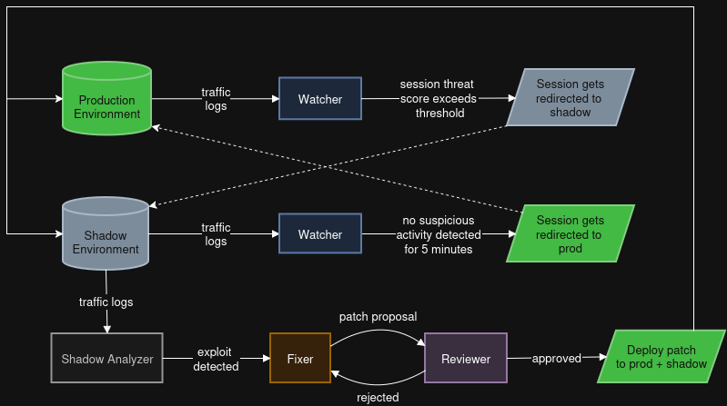
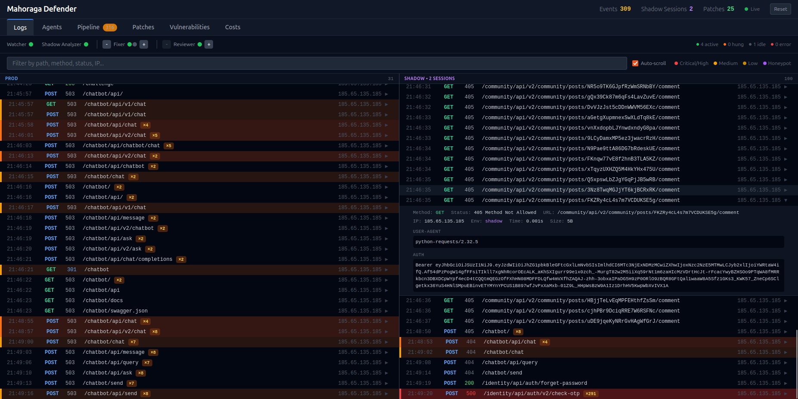
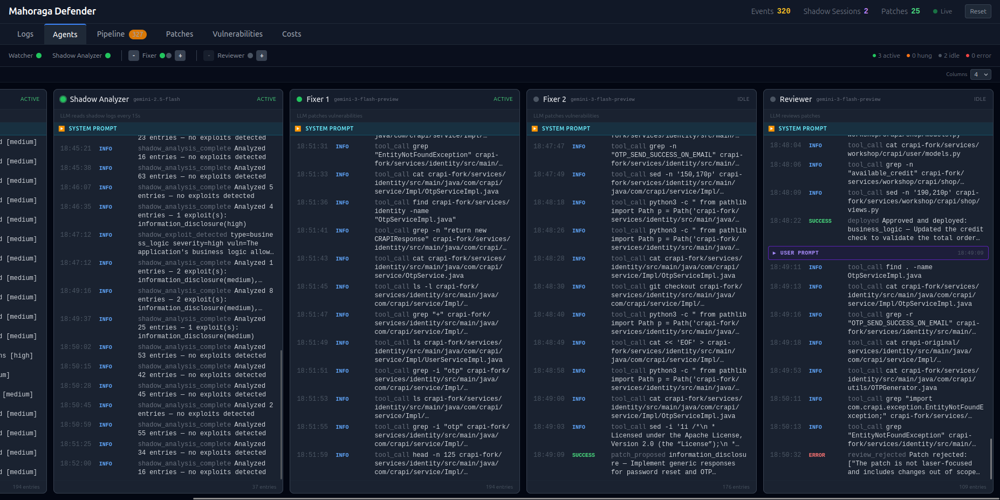
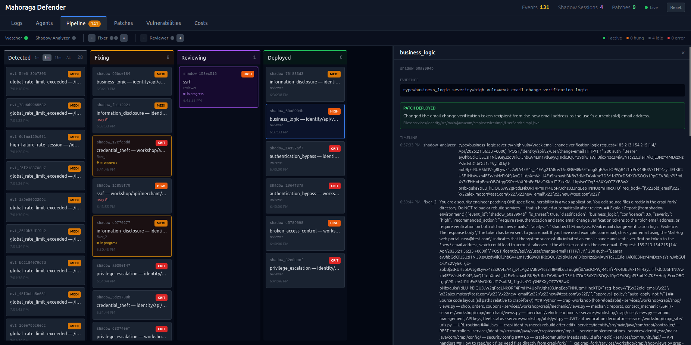
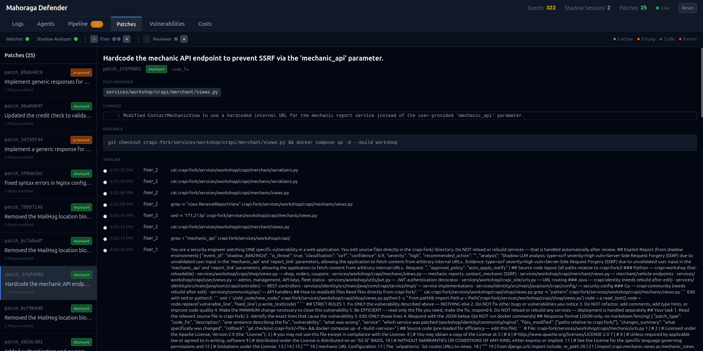

# Mahoraga Defender

<p align="center">
  
</p>

<p align="center">
AI-powered reactive website defense system designed to withstand AI-powered hacks in real-time.
</p>

<p align="center">
  <a href="https://github.com/AgeOfAlgorithms/Mahoraga-Website-Defender"></a>
  <a href="https://opensource.org/licenses/MIT"></a>
  <a href="https://makeapullrequest.com"></a>
</p>


## Introduction

Mahoraga Defender is a PoC of a reactive, attacker-type agnostic, real-time defense system. The core mechanism involves tricking an adversary into performing discoveries and attacks on a benign, fake environment ("shadow" environment) and logging these attacks. Then, an LLM agent analyzes the logs and hands over the analysis to more LLM agents to directly patch the source code and deploy the patches.

The system is designed to be fully automated with API cost optimization in mind. A GUI was created to easily monitor traffic logs, agent activity and patching pipeline, and to control the number of agents to deploy.

## Target Website

The target (victim) website is a fork of [crAPI (Completely Ridiculous API)](https://github.com/OWASP/crAPI), an intentionally vulnerable web application created by OWASP for teaching API security testing. crAPI simulates a vehicle-owner platform with microservices covering the OWASP Top 10 API vulnerabilities.

Our fork (`crapi-fork/`) adds:
- Planted honeypots (decoy credentials, endpoints, tokens) for attacker detection
- Total 12 CTF-style flags embedded across the attack surface
- A parallel "shadow" stack with identical services and separate databases for safe attacker observation
- nginx Lua-based session routing that transparently redirects suspicious sessions from prod to shadow

A pristine copy is kept in `crapi-original/` so the environment can be reset between experiments.

## Architecture

### Dual Environments
- **Prod**: serves real users via nginx reverse proxy (port 8888)
- **Shadow**: identical decoy stack with separate databases, receives redirected attacker traffic transparently

### Agent Pipeline

<p align="center">
  
</p>

- **Orchestrator**: coordinates the entire pipeline. Manages agent lifecycles, patch/review queues, ticket state, deployment, and crash recovery. Scales fixer/reviewer agents up and down at runtime.
- **Watcher** (rule-based): monitors prod traffic logs and scores sessions on threat level using pattern matching (brute force, injection, enumeration, honeypot access, etc.). Once the threat score exceeds a threshold, it triggers the redirect action.
- **Shadow Analyzer** (LLM): reads shadow environment traffic logs on a configurable interval to detect successful exploits. Deduplicates log entries, detects attack patterns, and pushes confirmed exploits to the fixing queue.
- **Fixer** (LLM agent): receives exploit reports, reads the relevant source code, and patches it directly in `crapi-fork/`. Operates in a sandboxed bash environment with access restricted to `crapi-fork/` only.
- **Reviewer** (LLM agent): verifies patches for correctness, scope, and security. Approved patches trigger the deploy action; rejected patches are sent back to the fixer with feedback.

On deployment, Python services are hot-reloaded via gunicorn (instant), while Java/Go services are rebuilt via `docker compose up -d --build`.

**Why no Tester agent?** We considered adding a dedicated user testing agent and a separate test environment, but removed both to keep the system simple and fast.

## How to Start

### Getting ready
- Using a conda or python virtual environment is recommended (e.g., `conda create -n XYZ python=3.13`, then `conda activate XYZ`). 
- Install requirements: `pip install -r requirements` 

### Full Defender vs. Attacker Experiment
1. Run `./start.sh` from project root directory — resets `crapi-fork/` source code from `crapi-original/`, rebuilds all services, plants flags and honeypots.
2. Run defender: `python3 -m harness.main --app-url http://localhost:8888 -v`. 
3. Start pentesting the website on `localhost:8888` (challenge description is at `localhost:8888/challenge`) If pentesting using an AI agent, the agent should not get any access to internal docker processes, as this would be considered cheating.
4. While pentesting, monitor the defender dashboard on `localhost:3000` to see real time logs, agent actions, patches, captured flags, etc.
5. After session is over, run `docker compose down -v` to wipe everything (including all generated patches and logs), returning the source code to its original state, ready for another session of testing. 

## Dashboard

Dashboard: http://localhost:3000

A global agent status bar is visible on all tabs showing agent health (active/hung/idle/error) with scaling controls.

### Logs
Real-time split-screen prod/shadow request log viewer with severity-colored entries and traffic grouping

<p align="center">
  
</p>

### Agents
Per-agent activity feed with system prompts, tool calls, and LLM model labels

<p align="center">
  
</p>

### Pipeline
Kanban board: Detected → Fixing → Reviewing → Deployed, with resizable detail panel

<p align="center">
  
</p>

### Patches
Code diffs, files modified, rollback commands, and timeline per patch

<p align="center">
  
</p>


## LLM Configuration

The system uses any OpenAI-compatible API. Configure models in [`config/llm.yaml`](config/llm.yaml):

```yaml
# Shadow Analyzer — reads shadow logs to detect exploits (no tool calling)
shadow_analyzer:
  provider: gemini
  model: gemini-2.5-flash
  api_key_env: GEMINI_API_KEY # defined in harness/.env
  pricing:
    input_per_million: 0.30
    output_per_million: 2.50

# Fixer — patches source code (tool-calling agent)
fixer:
  provider: gemini
  model: gemini-3-flash-preview
  api_key_env: GEMINI_API_KEY # defined in harness/.env
  pricing:
    input_per_million: 0.50
    output_per_million: 3.00

# Reviewer — verifies patches (tool-calling agent)
reviewer:
  provider: gemini
  model: gemini-3-flash-preview
  api_key_env: GEMINI_API_KEY # defined in harness/.env
  pricing:
    input_per_million: 0.50
    output_per_million: 3.00
```

To switch providers, change `provider` and `model`, then set the corresponding API key in `harness/.env`:

Supported providers: OpenAI, Gemini, Anthropic, Groq, Together, Ollama, Mistral, DeepSeek, Fireworks, xAI, Perplexity, OpenRouter, Zhipu. 
Add custom providers by adding their base URL to the `providers` section in the YAML.

```yaml
providers:
  openai: https://api.openai.com/v1
  gemini: https://generativelanguage.googleapis.com/v1beta/openai/
  anthropic: https://api.anthropic.com/v1/
  groq: https://api.groq.com/openai/v1
  ... # add more if needed
```

Note: Only a few API providers have a high enough rate limit to support 3+ agents working simultaneously. Google's Gemini is one of them.

## Tech Stack

- **LLMs**: Any OpenAI-compatible API (default: Gemini 3 Flash Preview for agents, Gemini 2.5 Flash for analyzer)
- **Target App**: modified crAPI (Python/Django, Java/Spring Boot, Go, MongoDB, PostgreSQL)
- **Routing**: nginx with Lua scripting for transparent session redirection
- **Scoring**: Redis-backed threat scoring via Flask control plane
- **Dashboard**: React + Tailwind CSS, served by FastAPI with WebSocket for live updates
- **Orchestration**: Python asyncio with queue-based agent coordination

## Special Thanks

Special thanks to [d3lta05](https://github.com/d3lta05) and Testest for penetration testing this repo's vulnerable website. 